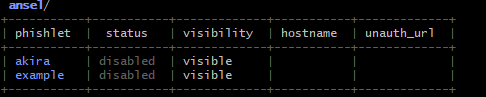

# Evilginx CheatSheet

1. Clone the git repo of [evilginx](https://github.com/kgretzky/evilginx2).

2. Configure [phishlets](https://github.com/kgretzky/evilginx2/blob/master/phishlets/example.yaml). Sample in link, amazing YAML ease of use.

3. Once the phishlets are configured, open Evilginx and you will see the phishlet. Then configure the domain and IP.
    

4. You can get help like `help <keyword>`.

5. Set the hostname which should end with the domain you created when configuring the domain and IP, like `same.dummy.com`.

6. Set the hosts file entry if in local.

7. Set the lure up. Create a lure using `lures create <phishlet>`. The rest of it `help lures` gives the manual.

8. Once you get the lure URL, either send it to someone you want to phish or try the URL if you are testing it out.

9. The session will be captured. Make sure to add the modifier `always` to capture the session token without an expiry date. You can use `sessions` to list sessions, and `sessions <id>` to list the details of the session.

10. You can personalize the lures. Example of sending the lure as an invoice download: `lures edit 0 path /download/invoice/5465/`. You can change the hostname of the URL by `lures edit 0 hostname this.is.a.real.website.fake.com`.

11. You can use custom parameters in lures like `lures get-url 0 email=abhishek@gmail.com name="Abhishek Narasimhan"`. Every time the URL parameter would be different and will be difficult to find.

12. Replacing content on the fly is amazing. Example: changing the "Login" button to anything you want it to be by updating the sub-filters in the YAML file. Example:
     ```yaml
     sub_filters:
        - {triggers_on: 'dummy.dum.evilginx.com', orig_sub: 'akira', domain: 'dum.evilginx.com', search: '" Login "', replace: '" Get Phished! "', mimes: ['text/javascript']}
     ```
